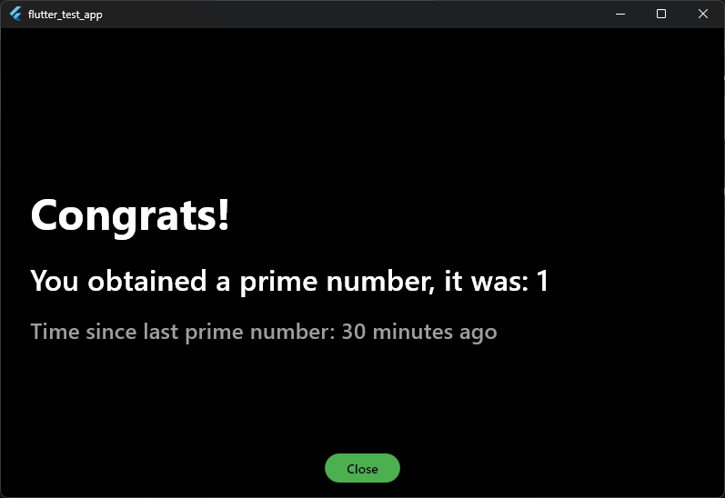

# Assumptions

- timer should be stopped while the second screen is visible and restart once the user comes back
- basic error handling sufficient
- it's ok to hack the challenge and not build a solid architecture with domain-driven design and proper state management
- magic numbers and magic strings ok
- no localization needed
- not central styling instance, I just applied everything to each widget as needed
- no need for custom widgets
- font sizes, distances, and colors are best-effort guesses
- it's ok when it works on some platforms (on web, there might be a CORS problem), Android and Windows work
- no performance optimizations needed
- a pragmatic and working solution is the goal

# Packages

### intl

Date formatting. It's powerful and easy.

### timeago

For showing elapsed time in a nicer way. Could also be achieved with difference() method of DateTime, but it would need manual tuning.

### http

For API requests. Alternative would be dio, but http is simpler while dio has more features like interceptors.

### shared_preferences 

To store data persistently. For complex data types, hive is better and faster. For security sensitive data I would have chosen flutter_secure_storage. For NoSQL in the cloud, Firebase Firestore would be an option. For SQL, supabase offers a good solution. It really depends on the use case.

# AI

I used AI to calculate the week number. The entire challenge could probably be solved faster by AI than me coding everything manually. In general, I use AI to debug, identify unknown error messages, and write boilerplate code. In complex apps, the prompts need so much context and refactoring that it's faster to code manually most of the time.

# Screenshots

